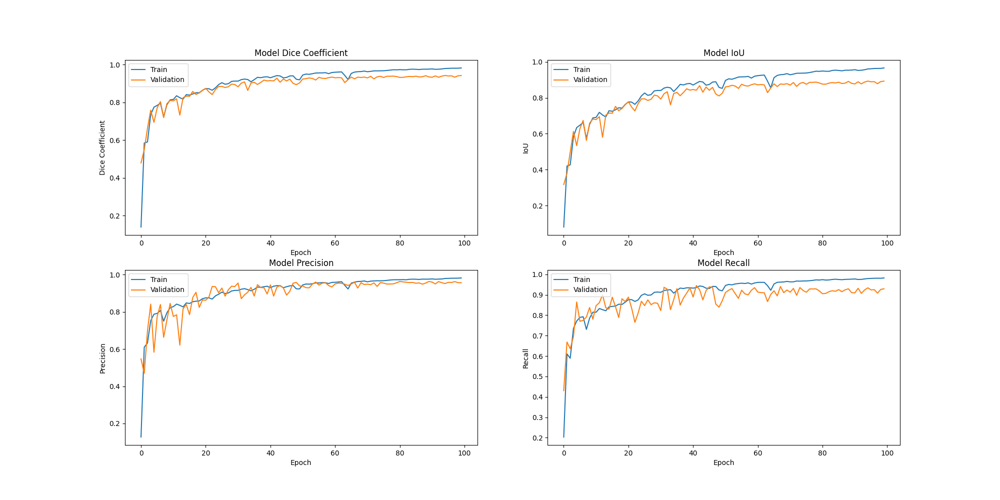

# Melt-Pool Segmentation with Attention U-Net

## Background
This codebase originates from MSc research focused on melt-pool monitoring in laser material processing using high-speed synchrotron X-ray radiography. The primary goal is the automated, frame-by-frame extraction of melt-pool boundaries to better understand and control the manufacturing process.

This repository contains the codebase for automated melt-pool segmentation from high-speed X-ray radiography images. An **Attention U-Net** implemented in TensorFlow/Keras is used to extract and track melt-pool boundaries accurately, providing metrics such as Dice coefficient, Intersection over Union (IoU), and Precision. 

## Model
The core architecture is an **Attention U-Net** built with TensorFlow/Keras:
* **Input:** Single-channel (grayscale) images resized to `1200x768` (shape: `768, 1200, 1`).
* **Output:** A single-channel probability map with a `sigmoid` activation function representing the melt-pool mask.
* **Loss Function:** Binary Crossentropy (`binary_crossentropy`).
* **Evaluation Metrics:** Dice Coefficient, Intersection over Union (IoU), Precision, and Recall.

## Project Structure
```text
.
├── src/
│   ├── train_unet.py      # Core script to train the Attention U-Net model
│   ├── predict_unet.py    # Generates predictions and calculates evaluation metrics
│   ├── sorting_image.py   # Utility to sort and correctly pair Training images with Masks
│   └── tif_to_png.py      # Preprocessing: converts TIFF images to PNG for compatibility
├── requirements.txt       # Project dependencies
├── LICENSE                # MIT License
└── README.md
```

*(Note: Data directories, source images, masks, predictions, and model weight `.h5` files are omitted from Version Control.)*

## Setup and Installation
1. **Clone the repository:**
   ```bash
   git clone https://github.com/Farshadmhd/melt-pool-segmentation.git
   cd melt-pool-segmentation
   ```
2. **Create a virtual environment (optional but recommended):**
   ```bash
   python -m venv venv
   source venv/bin/activate  # On Windows use `venv\Scripts\activate`
   ```
3. **Install Dependencies:**
   ```bash
   pip install -r requirements.txt
   ```

## Usage

### 1. Data Preprocessing
Annotation tools are often incompatible with the TIFF format. Use the conversion script to change your `.tif` files to `.png`:
```bash
python src/tif_to_png.py
```
After defining your masks, ensure that each training image is correctly paired with its corresponding mask using the sorting script:
```bash
python src/sorting_image.py
```

### 2. Training the Model
The script `src/train_unet.py` accepts command-line arguments. You can override the default paths to point to your local datasets:

Run the training script (using your own paths if different):
```bash
python src/train_unet.py \
    --train-path "/path/to/Label/Train_orginal" \
    --label-path "/path/to/Label/Mask" \
    --model-save-path "/path/to/save_model.h5"
```

### 3. Running Predictions
Similarly, `src/predict_unet.py` accepts arguments:

Run the prediction script:
```bash
python src/predict_unet.py \
    --model-path "/path/to/saved_model.h5" \
    --source-folder "/path/to/Label/useful" \
    --output-folder "/path/to/Label/Prediction_33"
```

## Results
The trained Attention U-Net model achieves robust extraction of the melt-pool boundaries. 

Below is an overview of the training and validation metrics over the epochs:


* **Dice Coefficient:** TODO
* **Intersection over Union (IoU):** TODO 
* **Precision:** TODO

